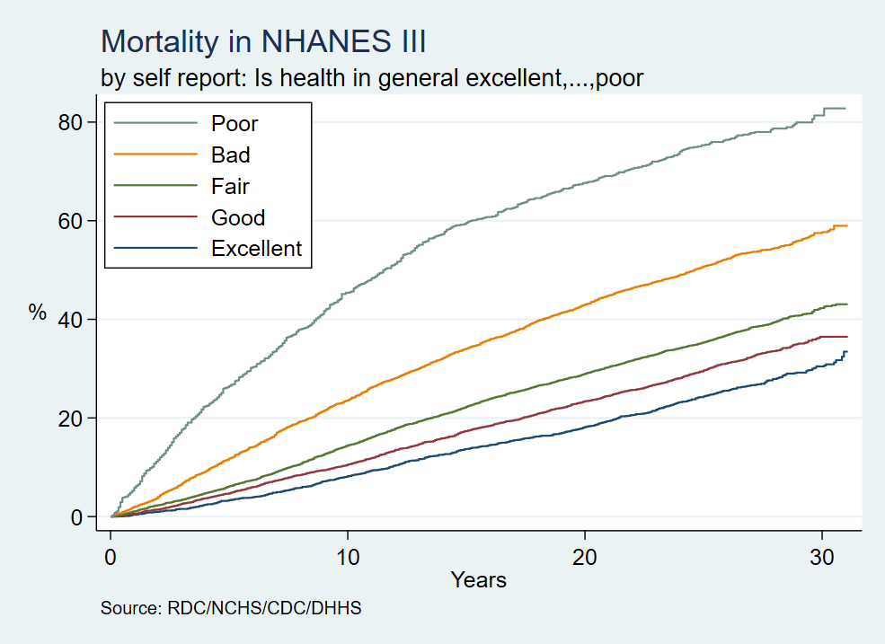

# Results

When a Kaplan-Meier graph pops up on your screen, that will be your cue that the program has run to completion and that you have an NHANES III dataset in your `pwd`.

```stata
set scheme s2color
nhanes
```



